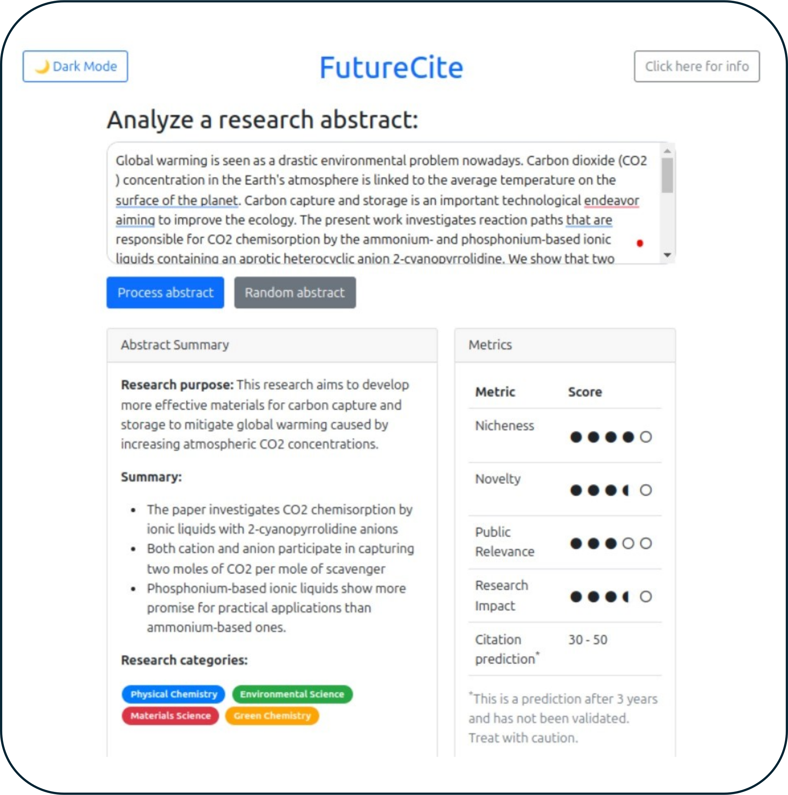
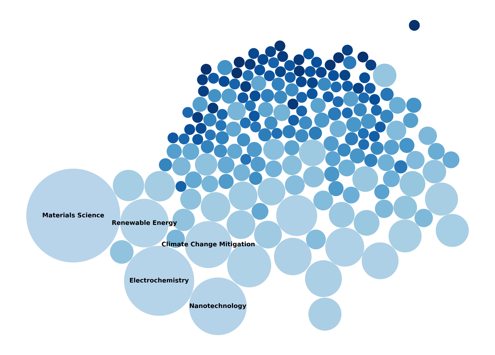

# 🔍 FutureCite 

FutureCite summarises abstracts and generates metrics to help researchers with their literature reviews. 
<p align="center">
  
</p>

# 📚 Context

Research articles are being published at a greater rate now than ever.

Staying up to date is being an increasingly more difficult task.

Large language models can quickly summarise and provide qualitative metrics!

# 📢 Use Cases

FutureCite is aimed at academic researchers. Use cases:

- Literature reviews: Helping researchers prioritize relevant research
- Time saving: Quickly assess the content of an abstract
- Improve writing: Receive feedback on your abstracts
- Citation prediction: Predicting the potential impact of your article


# ❔ How to use

To run locally, follow the below

1. Clone the github repo
```shell
git clone https://github.com/luchachi/FutureCite
cd FutureCite
```

2. Install the requirements
```shell
pip install -r requirements.txt
```

3. Run the flask backend
```shell
cd FutureCiteApp
python app.py
```

4. Open local host (`http://127.0.0.1:5000/`)

5. Follow the instructions in your browser

FutureCite uses the Anthropic API to process abstracts.
If you don't have an API key, you can get one by signing up at <a href="https://console.anthropic.com/settings/keys">Anthropic</a>.

# Using FutureCite for a large numbers of abstracts

FutureCite can be used to process many abstracts at once.

1. Prepare a `csv` file of abstracts with an `abstract` column.

2. Use script to process all abstracts in the dataframe. By default this will run on `demo_articles.csv`

```shell
cd example
python run_FutureCite_on_csv.py
```

2. Specify name of output csv file. currently this is named `Demo_results.csv`
</details>

We did this for ~500 abstracts from <a href = 'https://arXiv.org'>arXiv</a> and provide the tools in `example`

<div align="center">
  
  <p><em>FutureCite categorisation of ~500 abstracts from arXiv</em></p>
</div>

# ℹ️ Additional information
<details>
<summary> See details</summary>


### How it works 

A research article's citation count (number of times it is referenced or used in other reviewed work) is a key metric used by researchers, funding organizations, and journals to determine the relevance, attention, and impact of an article. FutureCite aims to estimate this value based on the abstract content, helping researchers gauge the potential impact of their work before publication.

We use the ClaudeAPI (Claude 3.5 Sonnet) to process abstracts.

The metrics are predictions based on Claude and should be treated as such.


### Fetching articles

<summary>Fetch articles from arXiv.</summary>

1. Fetch articles using API.

```shell
cd example
python fetch_articles.py
```

The output of this script has been saved as `Demo_articles.csv`.


</details>
